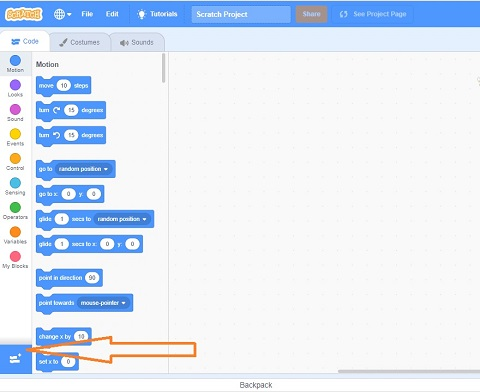
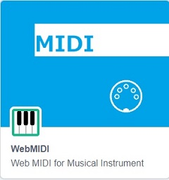
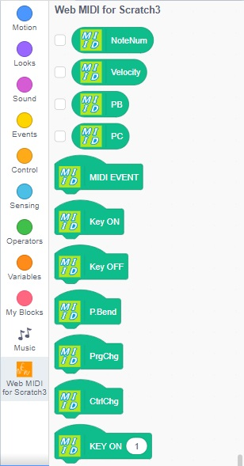
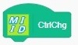
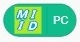
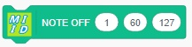

# Explanation for Scratch 3 MIDI

This extension is for using a MIDI device like a MIDI Controller through Scratch3. It's made by Web MIDI API. This API is one of the HTML5 functions defined by W3C.  

Application page is [Web MIDI Scratch 3](https://UchiwaFuujinn.github.io/scratch3webmidi/)  

### Reference
- [Web MIDI API Working Draft](http://www.w3.org/TR/webmidi/)
- [W3C](http://www.w3.org/)  
  
## Preparation

__Please Use Chrome.__ This extension is able to use only on Chrome. The other browsers are not supporting Web MIDI API now, April 2016. 
Do you know MIDI? MIDI is a protocol for connecting between MIDI Devices or a MIDI device to the PC. If you don't know, please see like a following page.

- [MIDI wiki](https://en.wikipedia.org/wiki/MIDI)
- [SUMMARY OF MIDI MESSAGES](https://www.midi.org/specifications)

Before you try to use these extensions, you should connect a MIDI device to your PC via USB. After you connect a MIDI device, you launch Chrome browser. Because Chrome browser finds the MIDI device when it launches. 

## Usage

- Open Scratch 3 Editor from [here](https://UchiwaFuujinn.github.io/scratch3webmidi/)
- Push the under-left icon.

- Select Web MIDI Extension form Extension list

- You can find Web MIDI blocks under the block paret.

### HAT Block

- 
indicates all midi event

- 
indicates note on event

- 
indicates note off event

- 
indicate pitch bend event

- 
indicate program change event

- 
indicate control change event

- 
indicates note on event with note number

### reporter block

-  Note Number

-  Velocity

-  Pitch Bend

-  Control Change Value

-  Program Number

### Boolean reporter

-  MIDI event

  - 'key on' --- key on event
  - 'key off' --- key off event
  - 'cc-chg' --- control change event
  - 'p-bend' --- pitchbend event
  - 'pg-chg' --- program change event

### Note On/Off Message

-  
Generates a MIDI NOTE ON message. The first parameter is a channel number, the second one is a note number and last one is a velocity. Normally the velocity is zero means note off. 
-  
With duration (continuous time), Generate a MIDI NOTE ON message. The last message is duration. The other parameters are same as above.
-  
  Generates a MIDI NOTE OFF message. The first parameter is a channel number, the second one is a note number and last one is a note off velocity. However few instrument adopt note off velocity. 

### Program Change Message

-  
First parameter is a channek number, the second one is program number.

### MIDI Output Device Number Select
-  
This message is a special message to select MIDI Output Device. If multiple MIDI devices are connected by your computer, you can select which device you send MIDI message.

## BEAT
The bellow messages are for "beat" and tick". 
-  

"beat" means timing signal of a quarter note. This hat code generates a pulse for each beat. And the parameter means Tempo. Tempo means the number of quarter notes while one minute. In this case, tempo=120, one time of each 500msec, the pulse is generated. 

-  

"tick" indicates a position of inside of a bar. In this extension, a quater note is as 480 ticks. So one bar is 1920 ticks. This reporter block displaies from 0 to 1920 cyclically..

-  
Wait for time of parameter ticks to run the next command.

